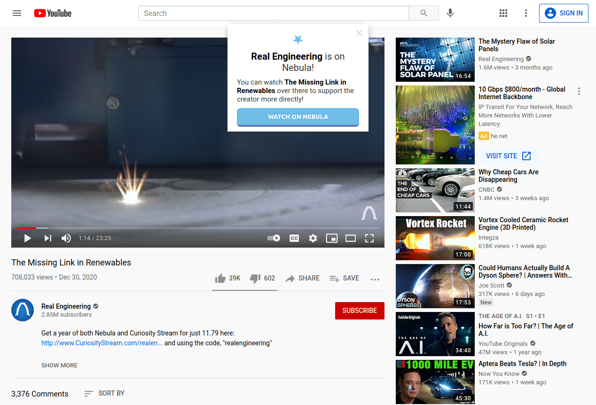
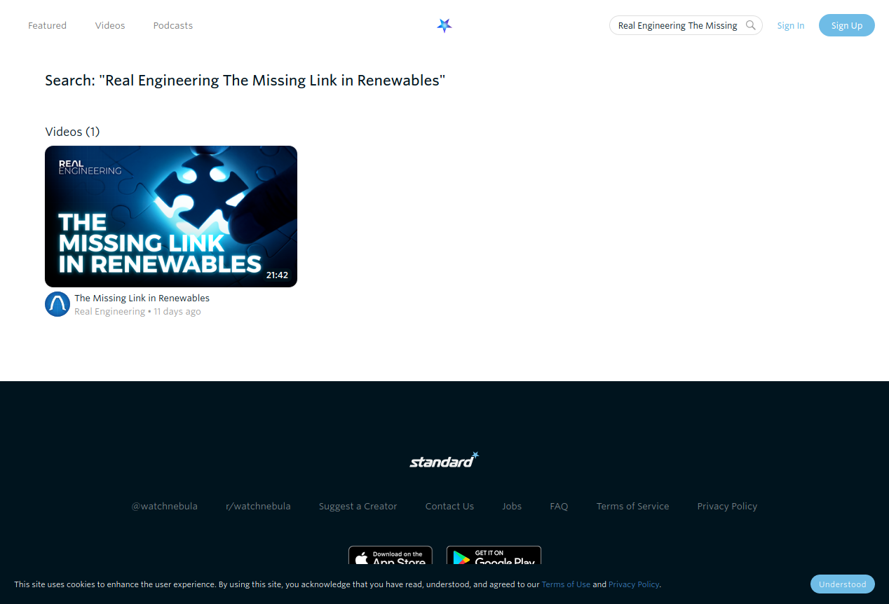

# 'Watch on Nebula' extension

> "I'm still discovering that some of my favorite youtubers are on nebula."

Same! And I'd like to support them over there.

## What is this?

A Firefox- and Chrome-compatible extension that will prompt you to watch videos on [Nebula](https://watchnebula.com) when possible.

Whenever you load a YouTube video, this extension will check if the creator is part of Nebula, and if so will prompt you with a link to watch their content over at Nebula instead.

## How to use

Simply add the extension from the official site corresponding to your browser.

- **Firefox**: https://addons.mozilla.org/en-US/firefox/addon/watch-on-nebula/
- **Chrome**: [link - todo]

That's it!

## Why is this important?

If you're subscribed to Nebula, your watch time is what directly supports your favorite creators. By watching the video on the Nebula platform you contribute to the share of profit that creator makes.

You might also discover that a creator you love on YouTube has some exclusive videos on Nebula you were missing out on since you didn't realize they were even on Nebula!

## Screenshots

When you're on a YouTube video where the channel is also on Nebula, this popup will show up:

Clicking the "Watch on Nebula" button will bring you to a search page on Nebula:

## Credits

The concept for this extension was wholly inspired by [this post by u/duckduckohno](https://www.reddit.com/r/watchnebula/comments/juqa5d/suggestion_youtube_subscription_tool/), and the implementation was sparked by [this post by u/KevineCove](https://www.reddit.com/r/watchnebula/comments/ek0zwh/list_of_current_creators/) on the r/watchnebula subreddit.

## Contributing

You can help out by contributing ideas or even developing parts of the code yourself.

### Ideas/Suggestions

Any feature requests or ideas for modifications and/or bug fixes? Post an issue! I'd greatly appreciate it.

### Developing

If you're using Firefox to develop, you can clone this repository then run `npm install` from a terminal in the root directory. From there, you can run `npm run start` to create a Firefox instance with the extension installed.
